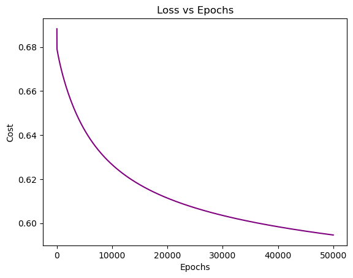
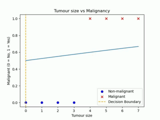
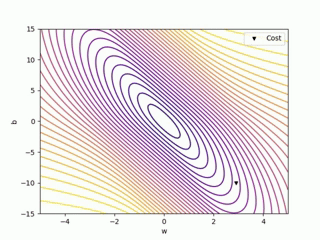

# 🔐 Logistic Regression from Scratch

An implementation of **Logistic Regression** built entirely from scratch,  
using only **NumPy**, **Pandas**, and **Matplotlib** — no `scikit-learn`.  

The repository contains:
- A practical application on a **real-world dataset**  
- Extra **visualizations with synthetic data** for better conceptual understanding  

---

## 📊 Dataset
- Dataset: **[OpenIntro Possum Data](https://www.kaggle.com/datasets/abrambeyer/openintro-possum)** from Kaggle  
- Task: Predict the **sex of a possum** based on multiple features  

---

## 🚀 Model Performance
- **Optimization:** Gradient Descent   
- **Final Accuracy:** `73.63%`  

📉 **Cost vs Iteration**  
Shows the convergence of the cost function as gradient descent progresses:  

---

## 📂 Additional Visualizations
A second notebook (`Logistic_Regression_Visuals.ipynb`) provides visual intuition using **synthetic datasets**.  
This includes animated plots for step-by-step understanding:

- **Sigmoid Function & Decision Boundary**  
  - Demonstrates how the sigmoid curve aligns to the data  
  - Shows the decision boundary settling between two classes  

  

- **Contour Plot of Cost Function**  
  - Visualizes the path taken by gradient descent while minimizing the cost  

  

---

## 🌃 End of the Line, Choomba  

Thanks for checking out this little project.  
BYE! BYE!

